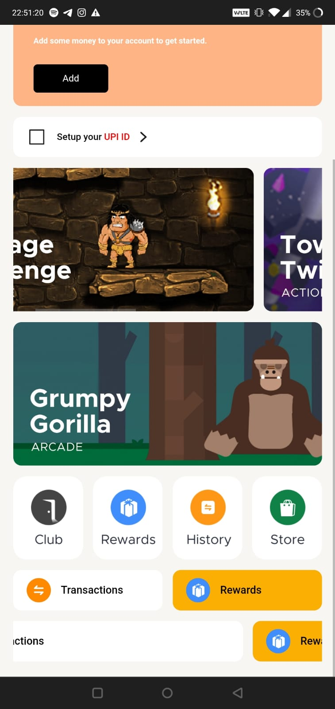
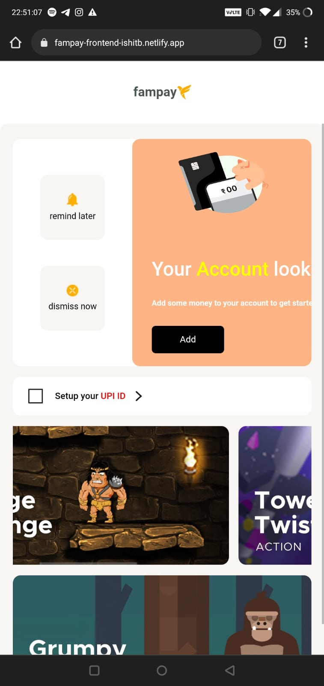

# Fampay Externship - Frontend Assignment
# Contextual Cards built with ReactJS

## Description
A Frontend App ( Mobile View ) to display contextual cards
Develop a React App, that displays a list of Contextual Cards
A Contextual Card is used to refer to a view that is rendered using json from an API
These views are dynamic and their properties like images, colour, texts, buttons (CTAs) etc. can be changed from the backend at any time.

The app renders the contextual cards in a list based on the API response that we get from the [API](https://run.mocky.io/v3/04a04703-5557-4c84-a127-8c55335bb3b4)

The design is based on this [Figma Page](https://www.figma.com/file/AvK2BRGwMTv4kQab5ymJ0K/AAL3-%3A-Android-assignment-Design-Specs)

## Preview Link
[Please click here for the Preview](https://fampay-frontend-ishitb.netlify.app/)

## Steps to run on local machine
- Make sure you have npm or yarn installed globall
- Download the zip or clone this github repository on your machine
- Add the environment variable according to the .env.sample file
- Run the following command to install the necessary dependencies
    
    npm
    ```bash
    npm install
    ```
    yarn
    ```bash
    yarn install
    ```
- Run the following command to start the app on your local server. By default the app will start on [http://localhost:3000](http://localhost:3000)

    npm
    ```bash
    npm run start
    ```
    yarn
    ```bash
    yarn start
    ```

## Screenshots

